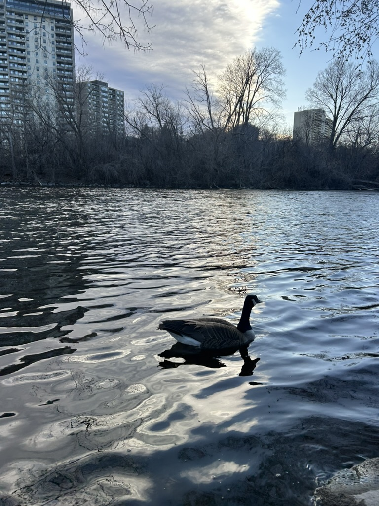

# Test Note

## Another heading

### Another heading
- Note here 
  - another
> A quotation

The command `git` is a tool

[Here](https://github.com/dashboard) is a link to github

[Mountain covered by snow](https://plus.unsplash.com/premium_photo-1692641346503-730862a6d3a2?q=80&w=1742&auto=format&fit=crop&ixlib=rb-4.1.0&ixid=M3wxMjA3fDB8MHxwaG90by1wYWdlfHx8fGVufDB8fHx8fA%3D%3D)

I love **bold text**

I also love __bold text__

Hello *beautiful*